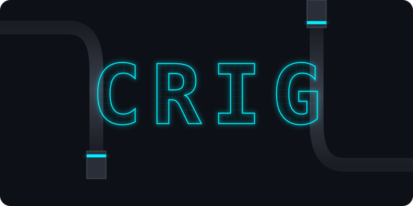
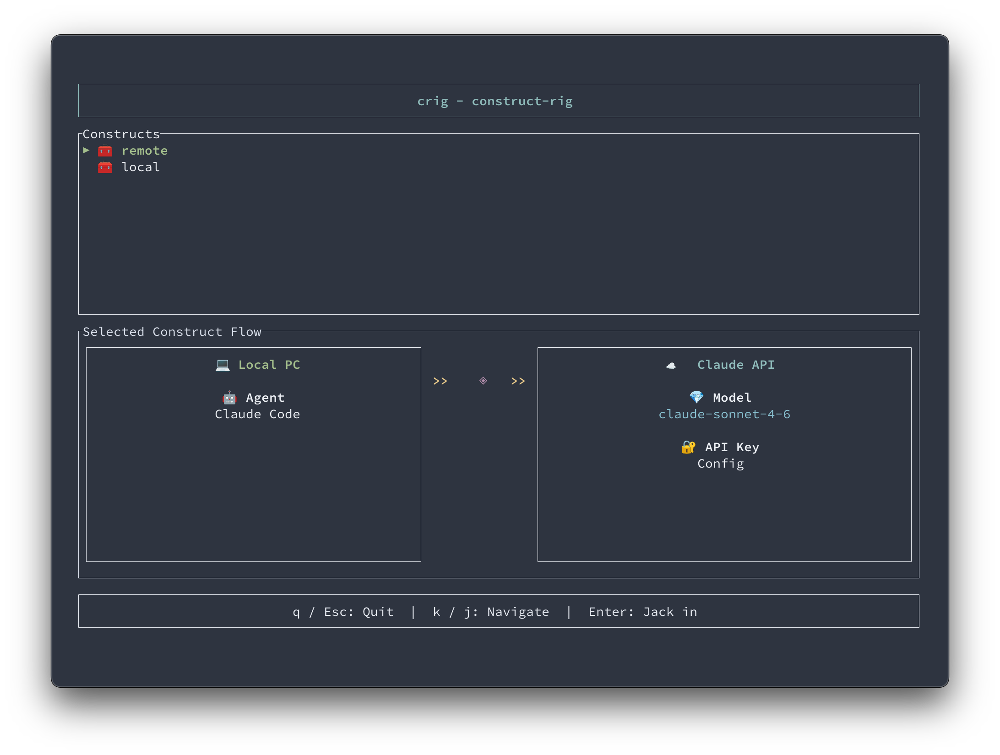

# crig (construct-rig)

[](#crig-construct-rig)

CLI tool for managing LLM and Agent configurations. Jack into your custom constructs.

## Features

- Jack in: Launch any Anthropic-compatible agent CLI with a chosen LLM backend
- Interactive construct configuration for agents and LLMs
- Graphical TUI to visualize and select constructs
- Optional lifecycle management for a local Ollama server
- Written in Rust

## What is a Construct?

A **construct** is a configured virtual environment (like a profile or preset). In cyberpunk terminology, "the construct" refers to a simulated reality or virtual space. In crig, each construct bundles:

- An **agent type** — Claude Code or Hermes
- An **agent path** — the CLI executable to launch (e.g. `claude`, `hermes`)
- An **LLM configuration** — Claude API, an Anthropic-compatible endpoint, or Ollama
- A **model name** and any auth / endpoint details

You "jack into" a construct to start the agent with that LLM wired up.

## Installation

### From Source

```bash
git clone https://github.com/massn/crig.git
cd crig
cargo build --release
```

## Usage

### Create or Update a Construct

Configure constructs interactively:

```bash
crig config
```

You will be asked for:
- **Construct name** (cannot be `default` — that is reserved as an alias for the active construct)
- **Agent type** — `Claude Code` or `Hermes`
- **Agent path** — path to the agent CLI executable (defaults to `claude` / `hermes`)
- **LLM type** — `Claude API`, `Anthropic-compatible`, or `Ollama` (Hermes hides `Anthropic-compatible`; see below)
- Type-specific details (API key, endpoint URL, model name, etc.)

### Remove a Construct

```bash
crig config remove                 # interactive prompt with tab-completion
crig config remove my-construct    # remove by name
```

### List and Jack In via TUI

View all constructs and jack into one interactively:

```bash
crig list
```



The TUI consists of three sections:

- **Constructs** — lists all configured constructs. The selected one is highlighted with `▶`. Use `k`/`j` or arrow keys to navigate.
- **Selected Construct Flow** — visualizes the construct as `Local PC (Agent) >> connection >> LLM`. The connection marker is `🔌` when the LLM endpoint resolves to localhost, `◈` otherwise (or for the Claude API).
- **Bottom bar** — keyboard shortcuts.

Press `Enter` to jack into the selected construct. Press `q` or `Esc` to quit.

### Jack In

Jack into a construct directly:

```bash
# Pick a construct via a tab-completion prompt
crig jack

# Jack in with the active construct (the `default` alias)
crig jack default

# Jack in with a specific construct and forward extra arguments to the agent
crig jack my-construct --help
crig jack my-construct "write a hello world program"
```

The `jack` command will:
- Resolve the construct (active one by default, or one chosen via tab-completion)
- Configure the spawned agent process with the construct's LLM settings (env vars and `--model`)
- Forward any additional arguments to the agent verbatim

### Custom Config Path

Use a custom config file location with the global `--config-path` option:

```bash
crig --config-path ~/my-configs/crig.toml config
crig --config-path ~/my-configs/crig.toml list
```

## Configuration File

Configuration is saved at:

- Default: `~/.config/crig/config.toml`

You can specify a custom config path using the `--config-path` option.

### Configuration File Format

Example `config.toml`:

```toml
active_construct = "remote"

[[constructs]]
name = "remote"
agent_type = "claude_code"
agent_path = "claude"

[constructs.llm_config]
type = "claude_api"
model = "claude-sonnet-4-6"

[[constructs]]
name = "local"
agent_type = "claude_code"
agent_path = "claude"

[constructs.llm_config]
type = "anthropic_compatible"
endpoint = "http://localhost:8080"
model = "llama3"

[[constructs]]
name = "hermes-cloud"
agent_type = "hermes"
agent_path = "hermes"

[constructs.llm_config]
type = "claude_api"
model = "claude-sonnet-4-6"

[[constructs]]
name = "ollama"
agent_type = "claude_code"
agent_path = "claude"

[constructs.llm_config]
type = "ollama"
endpoint = "http://localhost:11434"
model = "llama3"
# Optional. Sent as ANTHROPIC_AUTH_TOKEN to the agent. Defaults to "ollama".
# Useful when pointing at a remote Ollama-compatible endpoint that requires auth.
# api_key = "sk-..."
```

## Examples

### Configuration with Claude API

```bash
$ crig config
=== crig Configuration ===

Construct name: remote
Select agent type: Claude Code
Agent path: claude
Select LLM type: Claude API
Claude API key (leave empty to use environment variable):
Model name: claude-sonnet-4-6

✓ Construct 'remote' saved successfully!
```

### Configuration with an Anthropic-compatible endpoint

```bash
$ crig config
=== crig Configuration ===

Construct name: local-llm
Select agent type: Claude Code
Agent path: claude
Select LLM type: Anthropic-compatible
Endpoint URL: http://localhost:8080
Model name: llama3

✓ Construct 'local-llm' saved successfully!
```

### Configuration with Hermes

```bash
$ crig config
=== crig Configuration ===

Construct name: hermes-cloud
Select agent type: Hermes
Agent path: hermes
Select LLM type: Claude API
Claude API key (leave empty to use environment variable):
Model name: claude-sonnet-4-6

✓ Construct 'hermes-cloud' saved successfully!
```

When you jack in, crig invokes Hermes as `hermes chat --provider <p> --model <m>`. The provider is derived from the LLM type (`anthropic` for `claude_api`, `ollama` for `ollama`).

### Jacking In

```bash
$ crig jack remote
>> Initializing neural connection...
>> Construct: remote
>> Interface path: claude
>> LLM: claude-sonnet-4-6 (Cloud)

>> Jacking in...

# The agent (claude) starts with the construct's LLM wired up
```

## Supported Agents

| Agent | Invocation | LLM types supported |
|---|---|---|
| **Claude Code** (`claude`) | `<path> --model <m>` + `ANTHROPIC_*` env vars | Claude API, Anthropic-compatible, Ollama |
| **Hermes** ([NousResearch/hermes-agent](https://github.com/NousResearch/hermes-agent)) | `<path> chat --provider <p> --model <m>` | Claude API, Ollama |

### Why Hermes can't use `Anthropic-compatible`

Hermes reads its endpoint from `~/.hermes/config.yaml` and ignores `ANTHROPIC_BASE_URL`. crig cannot redirect Hermes to a custom endpoint via env vars, so the `Anthropic-compatible` LLM type is disallowed for Hermes constructs. To use a custom endpoint with Hermes, run `hermes model` (which writes `~/.hermes/config.yaml`) and pick the matching LLM type in crig.

### Hermes × Ollama caveat

crig manages the local `ollama serve` lifecycle and pulls the model, but the Hermes process discovers Ollama through its own `config.yaml`. If `hermes chat` cannot reach the Ollama endpoint, run `hermes model` and point it there.

## Supported LLMs

- Claude API (Anthropic)
- Anthropic-compatible endpoint (any local or remote `ANTHROPIC_BASE_URL`-compatible server)
- Ollama (with lifecycle management — crig can start/stop `ollama serve` for you)

### Ollama control

crig can manage a local Ollama server. Pick `Ollama` as the LLM type in `crig config`, or drive it directly:

```bash
crig ollama start              # start `ollama serve` detached (no-op if already running)
crig ollama status             # show whether ollama is reachable
crig ollama stop               # stop the server started by `crig ollama start`
crig ollama pull <model>       # pull a model into the server (e.g. llama3, llama3:8b)
```

All subcommands accept `--endpoint <url>` (default `http://localhost:11434`).

When you `crig jack` into an `Ollama` construct, crig will:

1. Check whether the endpoint host is local (loopback) or remote.
2. **Local endpoint** (e.g. `http://localhost:11434`):
   - If ollama is already reachable, use it as-is and leave it running after you exit.
   - Otherwise spawn `ollama serve` for the session and stop it when you jack out.
   - Pull the requested model on demand via `ollama pull` if it is not present.
3. **Remote endpoint** (e.g. `https://llm.example.com/`):
   - Verify reachability (TCP probe; default port 443 for `https://`, 11434 for `http://`).
   - Do **not** start a local `ollama serve` or attempt `ollama pull`.

### Auth token for Ollama-compatible endpoints

The Ollama LLM type accepts an optional API token. crig passes it to the agent
as the `ANTHROPIC_AUTH_TOKEN` environment variable (defaulting to the literal
string `"ollama"` when unset, which is what a vanilla local Ollama expects).

You can set it interactively via `crig config`, or directly in `config.toml`:

```toml
[constructs.llm_config]
type = "ollama"
endpoint = "https://llm.example.com/"
model = "gemma3:27b"
api_key = "sk-..."
```

crig configures the agent process by **setting environment variables directly on
the spawned child** — for non-Claude-API backends: `ANTHROPIC_BASE_URL`,
`ANTHROPIC_AUTH_TOKEN`, `ANTHROPIC_API_KEY` (cleared), and
`CLAUDE_CODE_USE_BEDROCK=0`. No `settings.json` is written to disk, so secrets
never land on the filesystem and your persistent `~/.claude/settings.json` is
left untouched.

## Development

```bash
# Build
cargo build

# Run in development mode
cargo run -- config

# Release build
cargo build --release
```

### Secret scanning (required setup)

This repo uses [gitleaks](https://github.com/gitleaks/gitleaks) to prevent accidental commits of API keys, tokens, and other secrets. CI runs gitleaks on every push and PR; locally, enable the pre-commit hook once per clone:

```bash
# Install gitleaks
brew install gitleaks   # or see https://github.com/gitleaks/gitleaks#installing

# Point git at the versioned hooks directory
git config core.hooksPath .githooks
```

If the hook flags a false positive, add an entry to `.gitleaks.toml` or annotate the line with `# gitleaks:allow`.

## License

MIT

## Contributing

Issues and Pull Requests are welcome!
